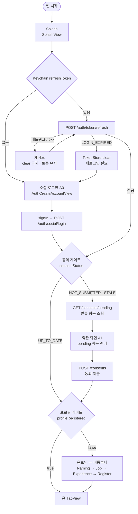
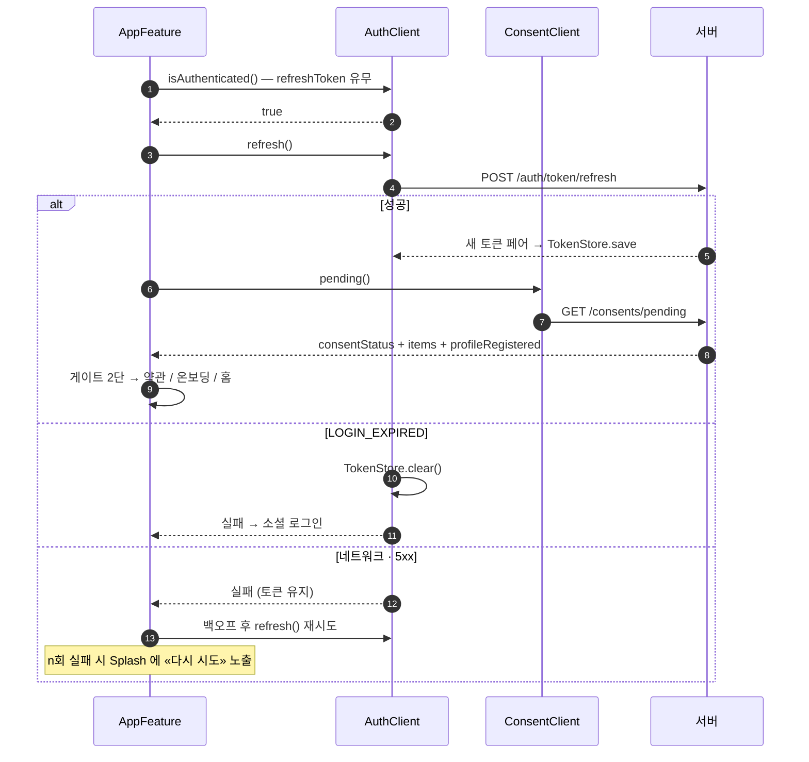
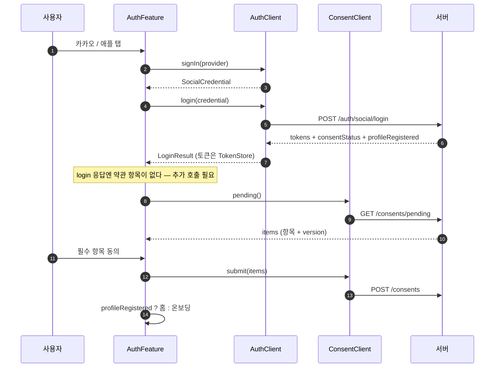
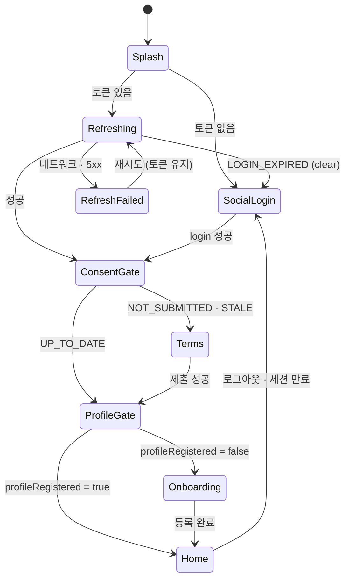

# 앱 진입 라우팅 — Splash → 로그인/약관/온보딩/홈

Splash 가 refreshToken 유무로 두 경로(신규 / 세션 복구)를 타고, 두 경로가 모두 **게이트 2단 체인**에 합류한다 — ① 동의 게이트(`consentStatus`) ② 프로필 게이트(`profileRegistered`). 목적지는 이 두 값만으로 결정되고, 판정값 출처만 경로별로 다르다.

## 1. 전체 흐름 (activity)

두 게이트는 순서가 고정이다 — 동의를 먼저 통과해야 프로필 게이트를 본다. `NOT_SUBMITTED`(신규 최초 동의)와 `STALE`(약관 개정 재동의)은 **같은 갈래**다. 차이는 `pending` 이 내려주는 `items` 뿐 — 최초는 필수 5종 전체, 재동의는 바뀐 항목만. 화면은 받은 항목을 그대로 렌더한다.

## 2. 목적지 표

| `consentStatus` | `profileRegistered` | 목적지 |
|---|---|---|
| `NOT_SUBMITTED` | false | 약관 → 온보딩(이름부터) |
| `NOT_SUBMITTED` | true | 약관 → 홈 |
| `STALE` | false | 약관 → 온보딩(이름부터) |
| `STALE` | true | 약관 → 홈 |
| `UP_TO_DATE` | false | 온보딩(이름부터) — 동의 후 이탈한 사용자 |
| `UP_TO_DATE` | true | 홈 직행 |

## 3. refresh 실패 분류 (clear 정책)

토큰 삭제는 **되돌릴 수 없는 로그아웃**이다. 재발급 실패를 두 종류로 갈라야 오프라인·서버 장애가 로그아웃 사고가 되지 않는다.

| 실패 | 판정 | 처리 |
|---|---|---|
| `LOGIN_EXPIRED` (refreshToken 만료·폐기) | 서버가 세션을 부정 — 복구 불가 | `TokenStore.clear` → 소셜 로그인 |
| 네트워크 단절 · 타임아웃 · 5xx | 세션 유효성 미판정 | **clear 금지**, 토큰 유지, 재시도 |
| 그 외 4xx | 계약 위반 — 서버 협의 대상 | 잠정: 재시도 후 실패 노출 (clear 금지) |

현행 코드는 이미 이 정책이다 — `AuthClient.refresh`(`AuthClient+Live.swift`)와 자동 재발급 경로(`AuthorizedNetworkClientLive.refreshTokens`) 모두 `catch let error as ServerError where error.code == "LOGIN_EXPIRED"` 에서만 `clear` 하고 나머지는 그대로 throw 한다. 자동 재발급은 `SingleFlight` 로 직렬화돼 있어 동시 만료에서도 재발급이 한 번만 나간다(Rotation 이라 중복 재발급 = 로그아웃 사고).

Splash 재시도는 화면이 필요하다 — 자동 백오프 n회 후에도 실패하면 Splash 에 실패 상태 + «다시 시도» 를 노출하고 그 자리에 머문다. 소셜 로그인으로 내보내지 않는다(토큰이 살아 있으므로).

## 4. 세션 복구 (sequence)

## 5. 신규 (sequence)

`login` 응답의 `consentStatus` 는 **`pending` 호출을 건너뛸지 판단하는 용도**다 — `UP_TO_DATE` 면 항목이 빈 배열이라 호출할 이유가 없다. 그 외에는 항목·버전을 받으려 반드시 `pending` 을 한 번 더 부른다(제출 payload 의 `version` 은 pending 값을 그대로 보낸다).

## 6. 루트 상태 머신

## 7. 구현 (2026-08-01 배선 완료)

| 지점 | 결과 |
|---|---|
| `AuthClient.login` | `-> LoginResult(consentStatus, profileRegistered)`. 응답의 `newUser`·`userInfo` 는 소비자가 없어 디코딩하지 않는다 |
| `ConsentPending` | `profileRegistered` 추가. **서버 배포 전 과도기** — 필드가 없으면 `false`(미등록)로 읽는다: 온보딩을 한 번 더 보는 쪽이 프로필 없이 홈에 앉는 쪽보다 안전한 실패 |
| `AuthClient.refresh` | `AppFeature` 판정 effect 에서 호출. 실패 2분류(`sessionExpired` → 재로그인 / 그 외 → 토큰 유지·재시도) |
| `AppFeature.State.root` | enum `splash`·`splashFailed`·`auth`·`home`. Bool 2개(`isCheckingSession`·`isAuthenticated`) 폐기 |
| `AuthFeature` | 게이트 2단(`enterGate` → `passProfileGate`). 세션 복구는 `State(resuming: Destination)` 으로 같은 체인에 합류 |
| `AuthTermsFeature` | 하드코딩 5종 enum 제거 — `pending()` 항목 렌더 + `document()` 전문 + `submit()` 제출. `CONSENT_VERSION_MISMATCH` 면 체크를 비우고 재조회 |
| `SplashView` | `onRetry` 를 받으면 실패 상태(재시도 노출), nil 이면 판정 중 |

목적지 표 6행과 복구 진입 2종은 `AuthFeatureGateTests` 가 검증한다. App 타겟엔 테스트 타겟이 없어 `AppFeature` 의 판정 effect(§4)는 미검증이다.

미결: ① 재시도는 수동(«다시 시도») — 자동 백오프 횟수·간격과 Splash 최소·최대 노출 연출 미정 ② 온보딩 중도 이탈 재진입이 이름부터 다시인지 이어받기인지 ③ `LOGIN_EXPIRED` 외 4xx 처리 확정(서버 협의) ④ 약관 «나중에» 선택지 존재 여부 — `STALE` 재동의에서 거부 시 홈 진입 허용 정책(면접 시작만 차단 안은 [home-account](home-account.md) §3) ⑤ Refresh 7일이 rotation 마다 리셋되는 슬라이딩인지 절대 7일인지(서버 확인) — 후자면 일주일 미접속 시 무조건 재로그인.
