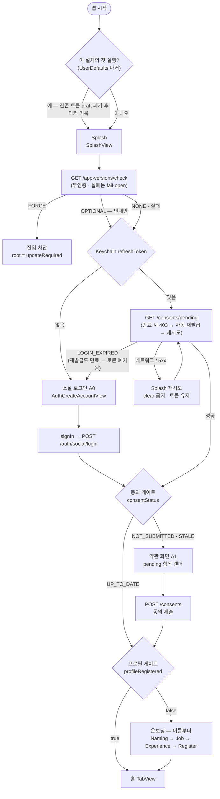
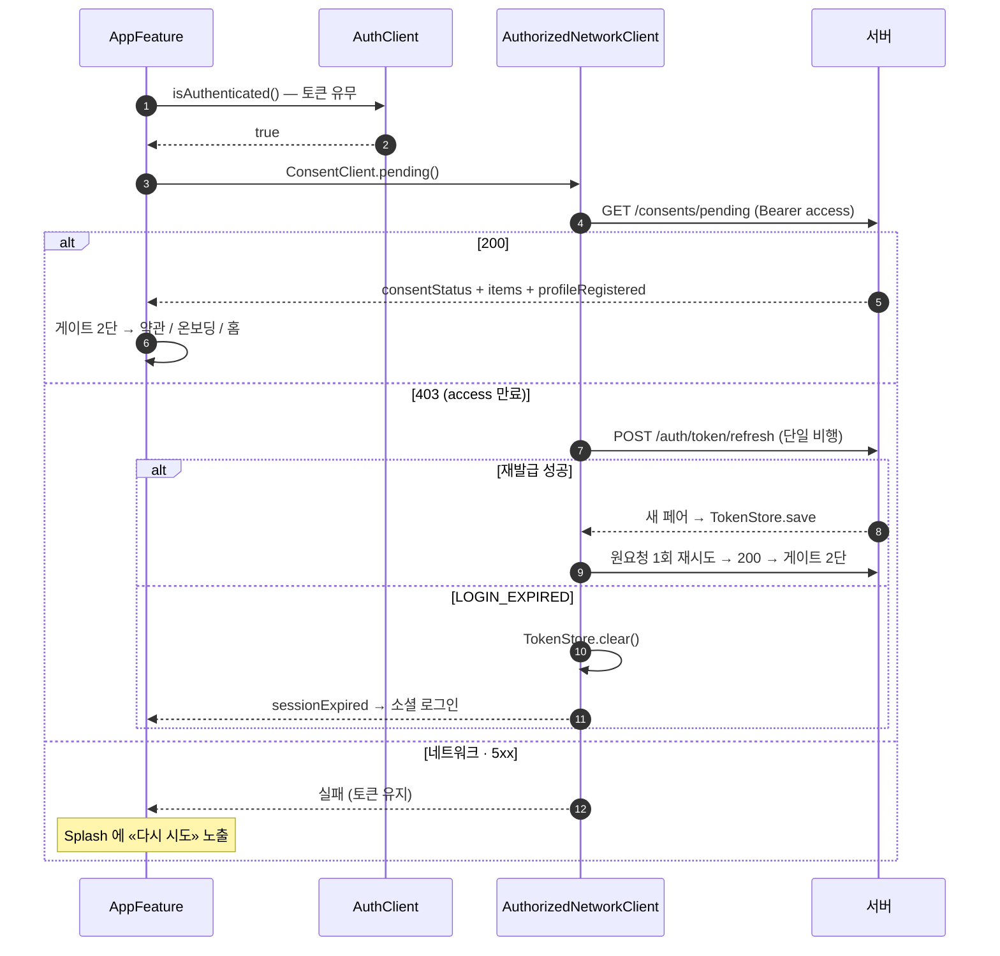
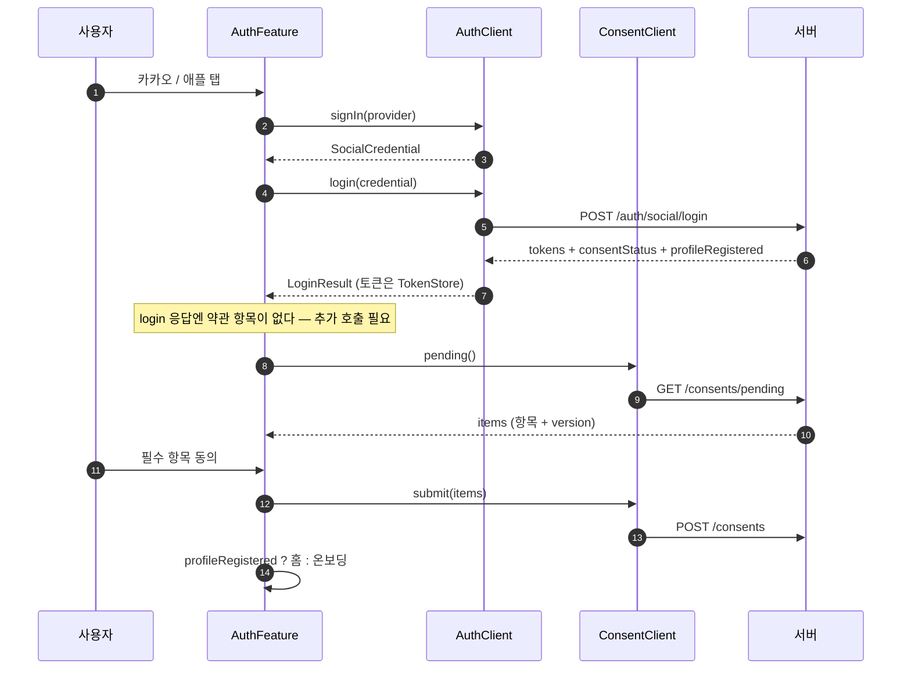
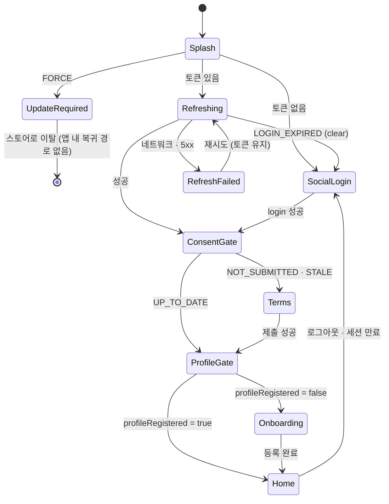

# 앱 진입 라우팅 — Splash → 로그인/약관/온보딩/홈

Splash 는 **버전 게이트**를 먼저 통과한 뒤 refreshToken 유무로 두 경로(신규 / 세션 복구)를 타고, 두 경로가 모두 **게이트 2단 체인**에 합류한다 — ① 동의 게이트(`consentStatus`) ② 프로필 게이트(`profileRegistered`). 목적지는 이 두 값만으로 결정되고, 판정값 출처만 경로별로 다르다.

버전 게이트(`GET /app-versions/check`)가 맨 앞인 이유는 순서가 곧 정책이라서다 — FORCE 를 세션 판정 뒤에 두면 이미 홈에 들어간 사용자를 되돌려 막게 된다. 무인증 API 라 토큰과 무관하게 돌릴 수 있다. 실패는 **fail-open** — 버전 정책 서버 장애가 앱 실행 자체를 막으면 안 된다.

판정 앞에 **첫 실행 정리**가 한 단 더 있다(§0) — 앱을 삭제해도 Keychain 은 남아, 재설치 직후를 «기존 세션» 으로 오판하는 걸 막는다.

세션 복구는 **refresh 를 먼저 부르지 않는다**(2026-08-02 단일화) — Access 는 3시간이라 콜드 스타트 대부분 살아 있고, `pending` 한 콜이 판정과 세션 검증을 겸한다. 만료면 그 403 을 `AuthorizedNetworkClient` 가 잡아 재발급 후 재시도하므로 별도 경로가 없다. 매 실행 무조건 rotation 은 콜 낭비 + 페어 교체 중 앱 킬 = 세션 유실 리스크.

## 0. 첫 실행 정리 (판정 이전)

앱을 삭제해도 iOS 는 Keychain 을 지우지 않는다. 우리 토큰은 Keychain(`TokenStore`)이고 나머지 로컬(온보딩 draft)은 UserDefaults 라 앱과 함께 사라진다 — 그래서 재설치하면 **토큰만 살아남아** Splash 가 «기존 세션» 으로 판정하고, 방금 새로 설치한 사용자가 로그인 상태로 들어온다.

판정 근거는 «앱과 함께 사라지는 저장소에 찍은 마커» 다. `FirstLaunchStore`(CoreCommon)가 UserDefaults 에 마커를 두고 `isFirstLaunch()` / `markLaunched()` 만 노출한다 — 마커 없음 = 이 설치의 첫 실행. 마커를 Keychain 에 두면 재설치 후에도 남아 첫 실행을 영원히 놓친다.

| 규칙 | 이유 |
|---|---|
| 정리가 **세션 판정보다 먼저** | 판정이 옛 토큰을 보기 전에 지워야 한다. `onAppear` 는 정리 effect 만 돌리고 `firstLaunchResolved` 로 갈라 그때 판정을 시작한다 |
| 마커는 **정리를 마친 뒤** 찍는다 | 사이에서 앱이 죽으면 다음 실행이 다시 첫 실행으로 판정돼 정리를 끝낸다. 먼저 찍으면 지우다 만 상태로 굳는다 |
| 정리 대상 선택은 **코디네이터 몫** | 스토어 계약은 판정만 맡는다. 대상은 Keychain 전체·온보딩 draft (`AppFeature.clearLocalData()` — dev 데이터 초기화 버튼과 공유) |
| Keychain 은 **클래스 단위로 전부** 지운다 | `tokenStore.clear()` 는 `account: "auth-tokens"` 한 항목뿐이라 항목이 늘면 잔존물이 생긴다. App 타겟 `KeychainWipe.wipeAll()` 이 아이템 클래스 5종을 비운다 |
| UserDefaults 는 **도메인째 지우지 않는다** | 첫 실행 마커가 거기 있다 — 통째로 날리면 다음 실행이 다시 첫 실행으로 판정된다 |

## 1. 전체 흐름 (activity)

두 게이트는 순서가 고정이다 — 동의를 먼저 통과해야 프로필 게이트를 본다. `NOT_SUBMITTED`(신규 최초 동의)와 `STALE`(약관 개정 재동의)은 **같은 갈래**다. 차이는 `pending` 이 내려주는 `items` 뿐 — 최초는 필수 5종 전체, 재동의는 바뀐 항목만. 화면은 받은 항목을 그대로 렌더한다.

## 2. 목적지 표

| `consentStatus` | `profileRegistered` | 목적지 |
|---|---|---|
| `NOT_SUBMITTED` | false | 약관 → 온보딩(이름부터) |
| `NOT_SUBMITTED` | true | 약관 → 홈 |
| `STALE` | false | 약관 → 온보딩(이름부터) |
| `STALE` | true | 약관 → 홈 |
| `UP_TO_DATE` | false | 온보딩(이름부터) — 동의 후 이탈한 사용자 |
| `UP_TO_DATE` | true | 홈 직행 |

## 3. refresh 실패 분류 (clear 정책)

토큰 삭제는 **되돌릴 수 없는 로그아웃**이다. 재발급 실패를 두 종류로 갈라야 오프라인·서버 장애가 로그아웃 사고가 되지 않는다.

| 실패 | 판정 | 처리 |
|---|---|---|
| `LOGIN_EXPIRED` (refreshToken 만료·폐기) | 서버가 세션을 부정 — 복구 불가 | `TokenStore.clear` → 소셜 로그인 |
| 네트워크 단절 · 타임아웃 · 5xx | 세션 유효성 미판정 | **clear 금지**, 토큰 유지, 재시도 |
| 그 외 4xx | 계약 위반 — 서버 협의 대상 | 잠정: 재시도 후 실패 노출 (clear 금지) |

현행 코드는 이미 이 정책이다 — `AuthClient.refresh`(`AuthClient+Live.swift`)와 자동 재발급 경로(`AuthorizedNetworkClientLive.refreshTokens`) 모두 `catch let error as ServerError where error.code == "LOGIN_EXPIRED"` 에서만 `clear` 하고 나머지는 그대로 throw 한다. 자동 재발급은 `SingleFlight` 로 직렬화돼 있어 동시 만료에서도 재발급이 한 번만 나간다(Rotation 이라 중복 재발급 = 로그아웃 사고).

Splash 재시도는 화면이 필요하다 — 자동 백오프 n회 후에도 실패하면 Splash 에 실패 상태 + «다시 시도» 를 노출하고 그 자리에 머문다. 소셜 로그인으로 내보내지 않는다(토큰이 살아 있으므로).

## 4. 세션 복구 (sequence)

## 5. 신규 (sequence)

`login` 응답의 `consentStatus` 는 **`pending` 호출을 건너뛸지 판단하는 용도**다 — `UP_TO_DATE` 면 항목이 빈 배열이라 호출할 이유가 없다. 그 외에는 항목·버전을 받으려 반드시 `pending` 을 한 번 더 부른다(제출 payload 의 `version` 은 pending 값을 그대로 보낸다).

## 6. 루트 상태 머신

## 7. 구현 (2026-08-01 배선 완료)

| 지점 | 결과 |
|---|---|
| `AuthClient.login` | `-> LoginResult(consentStatus, profileRegistered)`. 응답의 `newUser`·`userInfo` 는 소비자가 없어 디코딩하지 않는다 |
| `ConsentPending` | `profileRegistered` 추가. **서버 배포 전 과도기** — 필드가 없으면 `false`(미등록)로 읽는다: 온보딩을 한 번 더 보는 쪽이 프로필 없이 홈에 앉는 쪽보다 안전한 실패 |
| `AuthClient.refresh` | Splash 는 **호출하지 않는다**(2026-08-02 단일화) — 재발급은 pending 403 을 받은 인터셉터 몫. 명시적 refresh 는 남겨 둠 |
| `AppFeature.State.root` | enum `splash`·`splashFailed`·`updateRequired`·`auth`·`home`. Bool 2개(`isCheckingSession`·`isAuthenticated`) 폐기 |
| 버전 게이트 (2026-08-02 배선) | `AppVersionClient.check(AppEnvironment.marketingVersion)` 가 세션 판정보다 먼저. FORCE → `root = .updateRequired` + «업데이트» 버튼뿐인 알럿(스토어 다녀와도 재노출), OPTIONAL → 안내만 얹고 판정 계속, NONE·실패·버전 키 부재 → 통과. 문구·형태는 OS 기본 Alert 임시(시안 대기) |
| `AuthFeature` | 게이트 2단(`enterGate` → `passProfileGate`). 세션 복구는 `State(resuming: Destination)` 으로 같은 체인에 합류 |
| `AuthTermsFeature` | 하드코딩 5종 enum 제거 — `pending()` 항목 렌더 + `document()` 전문 + `submit()` 제출. `CONSENT_VERSION_MISMATCH` 면 체크를 비우고 재조회 |
| `SplashView` | `onRetry` 를 받으면 실패 상태(재시도 노출), nil 이면 판정 중 |
| 첫 실행 정리 (2026-08-03 배선) | `FirstLaunchStore`(CoreCommon — UserDefaults 마커)가 판정, `AppFeature` 가 `onAppear` → `firstLaunchResolved` 사이에서 Keychain 전체·draft 폐기(§0). 스토어 단위 테스트는 `CoreCommonTests` |

목적지 표 6행과 복구 진입 2종은 `AuthFeatureGateTests` 가 검증한다. App 타겟엔 테스트 타겟이 없어 `AppFeature` 의 판정 effect(§4)는 미검증이다.

미결: ① 재시도는 수동(«다시 시도») — 자동 백오프 횟수·간격과 Splash 최소·최대 노출 연출 미정 ② 온보딩 중도 이탈 재진입이 이름부터 다시인지 이어받기인지 ③ `LOGIN_EXPIRED` 외 4xx 처리 확정(서버 협의) ④ 약관 «나중에» 선택지 존재 여부 — `STALE` 재동의에서 거부 시 홈 진입 허용 정책(면접 시작만 차단 안은 [home-account](home-account.md) §3) ⑤ Refresh 7일이 rotation 마다 리셋되는 슬라이딩인지 절대 7일인지(서버 확인) — 후자면 일주일 미접속 시 무조건 재로그인 ⑥ 업데이트 안내 시안(강제·권장) — 현재 OS 기본 Alert, OPTIONAL 을 실행마다 띄울지 «이 버전 건너뛰기»를 둘지도 미정.
